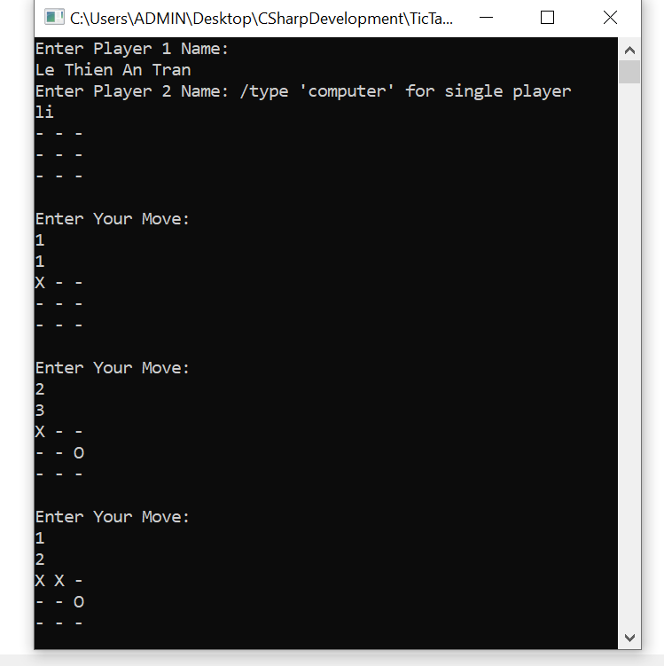

<h1 align="center"> Tic Tac Toe Console Program </h1>
<h2 align="center"> AUTHOR: LE THIEN AN TRAN </h2>
<h3> 1. About it </h3> 

 

This is the project that you can play Tic Tac Toe. In order to play the game, you will need to write in 2 player names or you can type 'computer' to enter single player mode. Enter the coordinates of the location you want to place your symbol ('x'/'o'). Here is the board grid and its location! 

--- | --- | --- (1,1 | 1,2 | 1,3)
 
--- | --- | --- (2,1 | 2,2 | 2,3)
 
--- | --- | --- (3,1 | 3,2 | 3,3) 

The project might have a little bug since I made it when I was in my second year of college, but it functionally works. In this project, I used object-oriented to create game board and players. As I remember, it was a little bit challenge for me at first, since it is my first project about OOP that I practice by my own outside the class. 

<h3> 2. How I made it? </h3> 

I came up with the idea of making tic tac toe when I was playing it with my classmate's son. As I remember, I was told by hium that "Why don't you make one for practicing?" after that. Therefore, I made it! 
  
I created a constructor with 2 parameters in order to create player and its symbol. I also initalized the game board. The board was made to print out everytime the player plays their moves. However, this is a second-year code of mine, and I don't really like it, so I might change it when I have time and make it print out only one board and make it looks like the board is directly getting the players' moves.
 
The BoardCheck() is an input checking function and works fine since it limited the player enter out of range input, however, I will need to fix it on prevent player from putting other characters as input. I rememebered it was tricky for me to prevent player from this, so I leave it for the last and I forgot, haha. Checking winning cases (horizontally, vertically and 2 ways diagonally). Checking for tie is always the last function that need execute, because if there is no win or lose, then it will just be a tie, or else, the tie function might messed up the program, even it rarely happens. 

<h3> 3. What I learned ? </h3>

<ul>
<li> More understanding about Object-oriented, creating object and calling methods although not all 4 principles of Object-oriented is used in this program </li>
<li> Write readability code, debugging, and improve my skills in avoiding redundant code </li>
<li> Think differently, outside the box, to imagine and get the idea of how the game should work, and how to draw the board of the game </li>
</ul>

<h3> 4. Tools </h3>

<ul>
<li> .NET </li>
<li> Visual Studio </li>
</ul>

